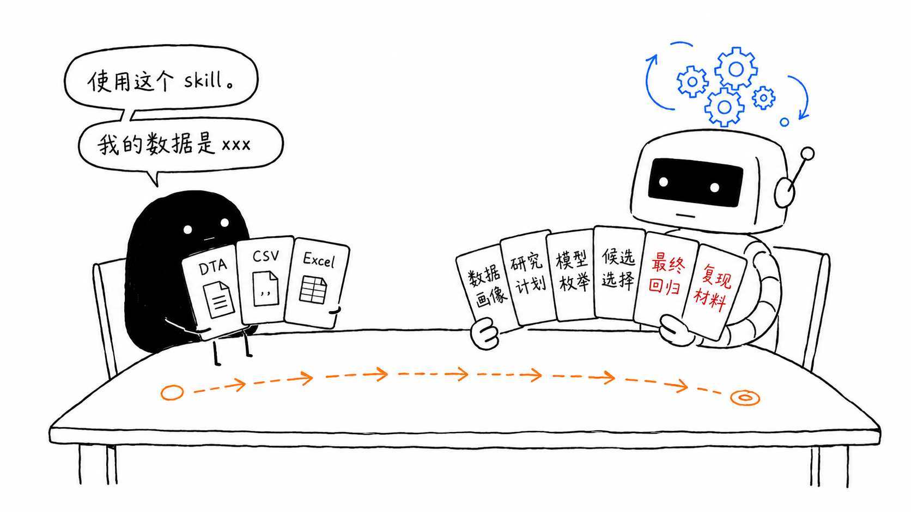

<div align="center">

# Starlane Skills

### 帮你“一键显著”的 Agent Skill

你来提供想法，我们帮你实现

[](LICENSE.md)
[](#快速开始)
[](skills/starlane-regression/SKILL.md)
[](README_EN.md)

[立即安装](#快速开始) · [架构说明](docs/ARCHITECTURE.md) · [English](README_EN.md)

</div>

Starlane Skills 关注的是把实证分析里的代码、模型枚举、结果整理和复现材料自动化；它不会替你捏造结论，也不会把不显著的结果包装成显著。

## 现在能做什么



当前版本提供一个正式 skill：`starlane-regression`。它围绕经管类实证研究里最常见的回归工作流，帮助你从数据和研究想法出发，逐步确认研究计划，枚举候选模型，选择结果，并生成最终输出和可复现源码。

第一版重点支持：

- 数据画像和变量角色初步判断
- 基准回归、控制变量组合和标准误选择
- 稳健性检验、机制检验、调节效应、异质性检验和 IV 相关检验
- Python / Stata 两种执行环境
- 候选模型汇总表、最终回归输出、运行说明和可复现源码

Starlane 更适合“我有数据和研究想法，但不想把时间都耗在回归代码和结果整理上”的场景。

## 快速开始

安装：

```bash
npx skills@latest add Manytw2/starlane-skills
```

然后在支持 Skills 的 Agent 工具中调用：

```text
/starlane-regression
```

你可以从一份数据文件和一个研究想法开始，也可以直接提供已经整理好的变量映射。Agent 会先和你确认研究设定，再把确认后的计划编译成可执行的回归任务。

## 开发者安装

```bash
git clone https://github.com/Manytw2/starlane-skills.git
cd starlane-skills
uv sync
```

Python 脚本请通过 `uv run python ...` 执行。

## 项目结构

```text
skills/
└── starlane-regression/
    ├── SKILL.md
    ├── references/
    └── scripts/
```

`SKILL.md` 是 Agent 入口；`references/` 放工作流、模型模块、输出规范和故障处理说明；`scripts/` 放数据画像、计划编译以及 Python / Stata 执行环境的脚本。

## 文档

- [架构说明](docs/ARCHITECTURE.md)
- [Architecture](docs/ARCHITECTURE_EN.md)
- [English README](README_EN.md)

## 边界

Starlane 是实证分析助手，不是论文代写工具，也不是显著性工厂。

它会保留变量映射、模型选择、生成代码和运行说明，帮助你复现结果；但研究问题是否成立、变量定义是否合理、模型解释是否可以支持因果结论，仍然需要你判断。

## 许可

本项目采用 [PolyForm Noncommercial License 1.0.0](LICENSE.md)。你可以将它用于非商业目的；商业使用需要单独授权。
