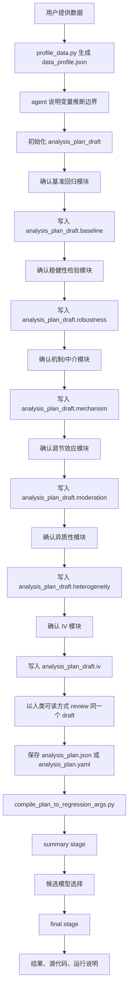

# Starlane Regression 引导式 Workflow 计划

## 概要

本文记录 `skills/starlane-regression` 当前的架构计划。

目标是把 `starlane-regression` 从“直接收集 regression args并执行”的 skill，升级为面向经管类本科学生的引导式实证回归 workflow。

核心决策：

- 保留一个用户入口：`starlane-regression`。
- 拆内容，不拆入口。
- Python 和 Stata 是 env，不是两套 workflow。
- 整个对话中只维护一个 `analysis_plan_draft`。
- 按模型模块逐段确认，每段确认后直接写入同一个 draft。
- 用户确认后的 plan 再编译成 regression args 合同。
- 模型引导、话术规范、schema、env 策略和 troubleshooting 放在 `references/`。
- 数据画像、plan 编译和实际执行代码放在 `scripts/`。

workflow 不应该是：

```text
模型引导 -> 另起一个分析计划 -> regression args
```

workflow 应该是：

```text
数据画像 -> 初始化 analysis_plan_draft -> 逐个模型模块确认并写回同一个 draft -> review 这个 draft -> 编译 regression args -> 执行
```

## 目标用户

第一目标用户是经管、金融、经济学及相关社会科学方向的本科学生。

他们通常知道基础回归，但需要引导来判断是否以及如何加入：

- 稳健性检验
- 机制/中介检验
- 调节效应
- 异质性检验
- 工具变量相关检验

agent 的定位是研究助理，不是门禁。agent 应该和用户一起讨论某个模型回答什么问题、是否适合当前研究、哪些变量可能对应这个模型，以及结果该如何谨慎表述。

## 架构

skill 应采用中等深度目录结构。避免两个极端：

- 所有文件平铺在一起。
- 文档和脚本层级过深，形成 agent 难以导航的文档迷宫。

当前目标结构：

```text
skills/starlane-regression/
  SKILL.md
  PLAN.md
  references/
    workflow.md
    agent-language-style.md
    analysis-plan-schema.md
    models/
      baseline.md
      robustness.md
      mechanism.md
      moderation.md
      heterogeneity.md
      iv.md
    output.md
    supported-methods.md
    troubleshooting.md
  scripts/
    workflow/
      profile_data.py
      compile_plan_to_regression_args.py
    envs/
      python/
        common.py
        summary.py
        final.py
        generate_final_source.py
      stata/
        summary.do
        generate_final_source.py
```

第一版不要拆成多个平铺 skill，例如：

```text
starlane-baseline
starlane-robustness
starlane-iv
```

学生侧入口应该始终是一个 skill。内部再路由到 workflow references、模型引导 references、env contract 和 env-specific scripts。

## Workflow



review 步骤不是第二次制定计划。它只是把同一个 `analysis_plan_draft` 以人类可读方式展示出来。

## 话术规则

agent 在确认变量时必须使用研究语言，而不是 regression args 语言。

应该说：

```text
基准回归里，核心解释变量选择 Attention，可以吗？
```

不应该说：

```text
x: Attention 对吗？
```

应该说：

```text
被解释变量先选择 lnApplyG 和 lnGrantG。
```

不应该说：

```text
y 是 lnApplyG lnGrantG。
```

应该说：

```text
机制检验里，机制变量选择 Charge、Subsidy、lnCSR。
```

不应该说：

```text
meds: Charge|Subsidy|lnCSR。
```

在提出变量角色建议之前，agent 必须说明推断边界：

```text
我先根据数据里的列名和基本结构做一个初步判断。因为变量名是你在数据中命名的，我只能从名称、类型、缺失情况和常见经管研究习惯推断变量角色，不能保证理解完全正确；如果某个变量的实际含义和我的推断不一致，以你的解释为准。
```

后端字段名可以出现在复现说明、生成代码说明和编译后的参数记录里，但不应该成为和用户确认研究设定时的主要表达方式。

## Envs

Starlane 只有一条 workflow，但可以有多个 env。

Python 和 Stata 是 env，不是两套用户 workflow。

不同 env 必须共享：

- `analysis_plan` schema
- 支持的模型族
- module section structure
- summary/final stage 合同
- candidate selection 标识
- 交付物清单
- 研究语言和解释边界

不同 env 允许不同：

- 估计器包和默认设置
- 固定效应吸收实现
- 标准误修正
- 包默认值导致的缺失值处理差异
- 生成源代码的形态
- Word/table 渲染实现
- runtime 和依赖记录

不要强行让 Python 模仿 Stata，也不要强行让 Stata 模仿 Python。跨 env 的逐系数数值一致不是目标。

目标是：

```text
同一条 workflow
同一个 analysis plan
同一套 module section structure
符合各自生态的、面向投稿复现的源代码和复现材料
清楚披露估计选择
```

## Analysis Plan Draft

plan 按模型模块组织，而不是按 regression args 平铺。

代表性结构：

```json
{
  "data": {
    "input_path": "/path/to/demo.dta",
    "profile_path": ".starlane/runs/run_id/data_profile.json",
    "panel": {
      "entity_var": "id",
      "time_var": "year"
    }
  },
  "research": {
    "topic_summary": "Attention and green innovation",
    "expected_direction": "positive"
  },
  "baseline": {
    "enabled": true,
    "outcomes": ["lnApplyG", "lnGrantG"],
    "explanatory_vars": ["Attention"],
    "controls": {
      "always_include": ["Scale", "Lev", "lnAge", "ROA"],
      "search_pool": ["Scale", "Lev", "lnAge", "Tange", "Cash", "ROA", "SOE", "Top1", "Inst"],
      "min_count": 5
    },
    "fixed_effects": {
      "entity": "id",
      "time": "year"
    },
    "vce_policy": {
      "summary_enumerate": ["ols", "robust", "cluster_entity", "cluster_entity_time"],
      "recommended_final": "cluster_entity"
    }
  },
  "robustness": {
    "enabled": true,
    "alternative_outcomes": ["lnAGreenInv", "lnGGreenInv"],
    "alternative_explanatory_vars": [],
    "lag_explanatory_vars": [1],
    "log_y": false,
    "log_x": false,
    "sample_window": null
  },
  "mechanism": {
    "enabled": true,
    "variables": ["Charge", "Subsidy", "lnCSR"]
  },
  "moderation": {
    "enabled": true,
    "variables": ["OverSea", "lnMediaPos", "lnMediaNeg"]
  },
  "heterogeneity": {
    "enabled": false,
    "discrete_groups": [],
    "selected_values": {}
  },
  "iv": {
    "enabled": true,
    "instruments": ["Thermalinv"],
    "interpretation_policy": "exploratory"
  },
  "execution": {
    "env": "python"
  }
}
```

compiler 会把这个 plan 转成当前 regression args 顺序。regression args 合同是实现边界，不是用户侧交互模型。

## 当前实现状态

当前实现已经向这份计划推进：

- `SKILL.md` 是 orchestration entrypoint。
- module references 已整合 guidance、plan 字段、section schema 和 regression args。
- Python 和 Stata env workflow 已集中在 `references/workflow.md`。
- workflow scripts 位于 `scripts/workflow/`。
- env scripts 位于 `scripts/envs/python/` 和 `scripts/envs/stata/`。
- 旧的顶层 script wrapper 已移除。

当前执行入口：

```text
uv run python scripts/workflow/profile_data.py ...
uv run python scripts/workflow/compile_plan_to_regression_args.py ...
uv run python scripts/envs/python/summary.py ...
uv run python scripts/envs/python/generate_final_source.py ...
uv run python scripts/envs/stata/generate_final_source.py ...
scripts/envs/stata/summary.do
```

## 验收标准

- 用户只提供数据文件时，agent 能引导完成数据画像和模型模块确认。
- agent 不以原始 regression args 作为主要交互方式。
- agent 在整个对话中维护同一个 plan draft。
- 最终 plan review 是同一个 draft 的展示，不是第二次制定计划。
- 编译后的 regression args 符合 regression args 合同。
- Python 和 Stata 被描述为 env，不是两套 workflow。
- 不把跨 env 数值一致作为目标。
- 当前 env entrypoints 可以在没有旧顶层 wrapper 的情况下运行。
